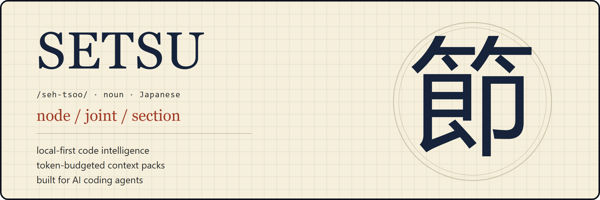

<div align="center">



<br><br>

<h3>Give coding agents the code they need —<br>not the whole repository.</h3>

<a href="docs/">Documentation</a> · <a href="#-quickstart">Quickstart</a> · <a href="#-commands">Commands</a> · <a href="#-privacy">Privacy</a> · <a href="#️-roadmap">Roadmap</a>

<br>

<a href="https://www.npmjs.com/package/@setsu-ai/cli"></a>
<a href="LICENSE"></a>
<a href="https://modelcontextprotocol.io"></a>
=22.13">
<a href="https://github.com/aritraghosh01/setsu/releases/tag/v0.1.0-beta.1"></a>
<a href="#-contributing"></a>

<br><br>

```bash
npx @setsu-ai/cli init                 # detect agents, build the graph, wire up MCP
setsu context "How does auth work?"    # token-budgeted evidence, not the whole repo
```

<sub>Available on npm as <a href="https://www.npmjs.com/package/@setsu-ai/cli"><code>@setsu-ai/cli</code></a> · latest version <b>0.1.0-beta.1</b> (2026-09-08) · for Claude Code, Codex, Cursor, Copilot and Kiro</sub>

</div>

<br>

---

## 🧠 What is SETSU?

AI coding agents rediscover your repository from raw files on every task: grep, read,
re-read, repeat. That loop burns your context window and your money.

SETSU builds a **persistent code graph** of your repository once (tree-sitter parse →
symbols and typed edges → PageRank and communities → SQLite), keeps it fresh
incrementally, and answers questions with **token-budgeted evidence packs** — the
smallest set of signatures, snippets, and graph paths that answers the question, with
provenance on every edge.

- 🗺️ **Persistent code graph** — symbols, calls, imports, implements, tests; typed and provenance-labeled
- 🎯 **Token-budgeted retrieval** — every pack has a hard budget; a greedy value/cost packer fills it
- 🔀 **Adaptive routing** — graph traversal, lexical FTS, repo map, or hybrid, chosen per task
- ⚡ **Incremental** — content-addressed cache; unchanged files are never reparsed
- 🔌 **MCP-native** — five tools, stdio only, no network listener
- 📉 **Instruction doctor** — measures what your CLAUDE.md/rules actually cost per session
- 🧪 **Learns locally** — which strategy works for which task class, on your machine only
- 🔒 **No API key. No account. Source never leaves your machine.**

## ⚙️ How it works

```text
            AI CODING AGENT (Claude / Codex / Cursor / ...)
                              │  setsu_context("How does checkout reach Stripe?")
                              ▼
                    ┌──────────────────┐
                    │   SETSU ROUTER   │  task classifier
                    └────────┬─────────┘
          ┌─────────────────┼──────────────────┐
          ▼                 ▼                  ▼
   Graph traversal    Lexical / FTS5      Repo map (PageRank)
          └─────────────────┼──────────────────┘
                            ▼
                  TOKEN BUDGET PACKER
                            ▼
              ContextPack (~1,300 est. tokens)
     path: CheckoutController → CheckoutService → PaymentGateway → StripeAdapter
```

Below the retrieval layer: files → content hash → tree-sitter parse → symbol +
edge extraction → import resolution → PageRank + Louvain communities → SQLite
(FTS5 included) → incremental watcher.

## ⚡ Quickstart

```bash
npm install -g @setsu-ai/cli    # or npx @setsu-ai/cli init

setsu init                      # detect agents, build the graph, offer MCP install
setsu context "How does checkout reach the payment gateway?" --explain
setsu doctor                    # what your agent setup costs per session
setsu optimize --dry-run        # what SETSU would improve, as diffs
```

## 🧰 Commands

| Command | What it does |
|---|---|
| `setsu init` | Detect agents, create `.setsu/`, build the graph, offer MCP + guidance install |
| `setsu context "<q>"` | Token-budgeted evidence pack; `--budget`, `--explain`, `--json` |
| `setsu symbol <name>` | Definition, signature, callers, callees |
| `setsu path <a> <b>` | Shortest relationship chain with edge types + provenance |
| `setsu impact <name>` | Blast radius: dependents, affected tests and files |
| `setsu index [--watch]` | Incremental reindex (or keep it fresh continuously) |
| `setsu doctor` / `setsu scan --ci` | Context Efficiency Score, instruction cost, thresholds for CI |
| `setsu optimize [--dry-run\|--apply]` | Guidance + MCP install with backup/rollback; advisory dedupe |
| `setsu learn` / `setsu feedback` | Learned strategy scores; rate the last pack |
| `setsu privacy inspect\|purge` | Exactly what is stored where; delete it all |
| `setsu mcp serve` | The 5-tool MCP surface over stdio |
| `setsu benchmark` | Grep-first baseline vs SETSU, estimated tokens, honest numbers |

## 🔒 Privacy

Everything is local: the graph lives in `~/.setsu/repos/<id>/graph.db`, usage
learning in `~/.setsu/setsu.db`. No network calls, no telemetry, no accounts.
Task terms are hashed with a per-device salt before storage; raw prompts are
never persisted. `setsu privacy inspect` lists every stored category and
location; `setsu privacy purge --yes` deletes all of it.

## 🗺️ Roadmap

| Version | Focus | Status |
|---|---|---|
| v0.1 | TS/JS + Python graph, hybrid retrieval, MCP, doctor/optimizer, local learning | this release |
| v0.2 | Java/C#/Go/Rust, deep LSP enrichment, Kiro/Copilot deep adapters, framework route + test + database graphs, retrieval bandit | planned |
| v0.3 | Optional semantic retrieval, cross-agent config compiler, Graphify import, Serena bridge, memory provider SDK | planned |

## 🤝 Contributing

Contribution ladder — pick your entry point:

1. **Benchmark task** — add a task to `benchmarks/`; retrieval quality lives and dies by real questions
2. **Fixture + golden** — a code pattern we extract badly makes a great failing test
3. **Language extractor** — `packages/parsers/src/extractors/` has the pattern to follow
4. **Adapter depth** — deepen Copilot/Kiro config generation in `packages/agents`
5. **Core** — router, packer, graph algorithms

`npm install && npm test` is all it takes to start. Every PR needs tests.

## 📄 License

Apache-2.0 © 2026 Aritra Ghosh · [NOTICE](NOTICE) · [Third-party notices](THIRD_PARTY_NOTICES.md)

<div align="center">
<sub>節 — setsu: the node where things join.</sub>
</div>
